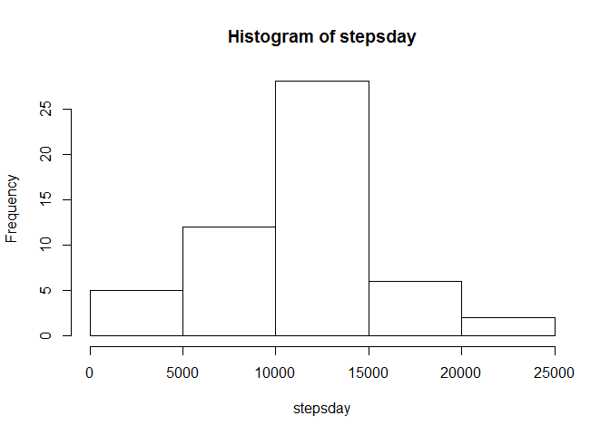
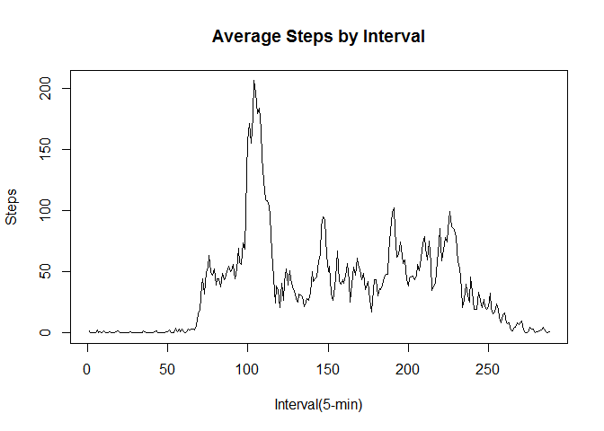
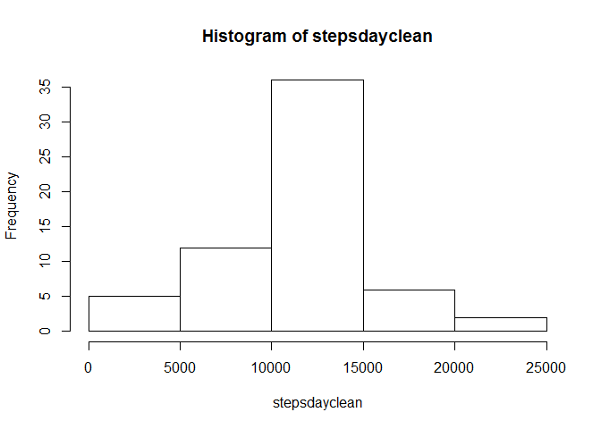
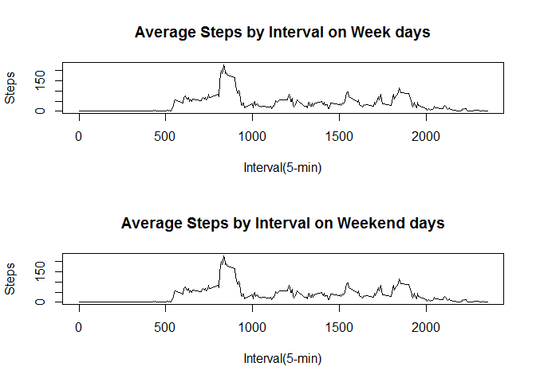

# Reproducible Research: Peer Assessment 1

**Loading and preprocessing the data**


```r
rawdata <- read.csv("activity.csv")
```

**What is mean total number of steps taken per day?**

    1. Calculate the total number of steps taken per day.
        *Note: days without readings could be repersented as "0" if the "na.rm = TRUE" argument was passed. However, this does cause the histogram created in the next step to not as nicely repersent a bell curve.*


```r
stepsday<- tapply(rawdata[,1], rawdata[,2], sum)
```
    2. Make a histogram of the total number of steps taken each day.
    

```r
hist(stepsday)
```

 
    3. Calculate and report the mean and median of the total number of steps taken per day.
    *Note: The "na.rm = TRUE" argument is required.*
    

```r
meansteps <- mean(stepsday, na.rm = TRUE)
mediansteps <- median(stepsday, na.rm = TRUE)
print(cbind(meansteps, mediansteps))
```

```
##      meansteps mediansteps
## [1,]  10766.19       10765
```

**What is the average daily activity pattern?**
    
    1. Make a time series plot (i.e. type = "l") of the 5-minute interval (x-axis) and the average number of steps taken, averaged across all days (y-axis).
    
    *To view the data by average steps an interval across all days we will need to rework the original data with another tapply function this time indexed by the interval and not the day. Remember to remove NA values.* 
    

```r
stepsint <- tapply(rawdata[,1], rawdata[,3], mean, na.rm = TRUE)
plot(stepsint, type = "l", xlab = "Interval(5-min)", ylab = "Steps", main = "Average Steps by Interval")
```

 

    2. Which 5-minute interval, on average across all the days in the dataset, contains the maximum number of steps?
    
    *The which function will give you the interval and then the column number. Using it with the subset will give you the interval and the value.* 
    

```r
stepsint[which(stepsint == max(stepsint))]
```

```
##      835 
## 206.1698
```

**Imputing missing values**

    1. Calculate and report the total number of missing values in the dataset (i.e. the total number of rows with NAs)
    
    *TRUE values are seen in a numeric context as being equal to 1, so summing the list output of the function is.na for steps will give us the number of NA's.
    

```r
sum(is.na(rawdata[,1]))
```

```
## [1] 2304
```

    2. Devise a strategy for filling in all of the missing values in the dataset. The strategy does not need to be sophisticated. For example, you could use the mean/median for that day, or the mean for that 5-minute interval, etc.
    3. Create a new dataset that is equal to the original dataset but with the missing data filled in.
    
    *The values of the steps field seem to vary more by interval than by day. ThereforI will use the average interval value across all days as a fill for missing values*


```r
totalintervals <- nrow(rawdata)
cleandata <- rawdata
    for(i in 1:totalintervals){
        if(is.na(cleandata[i, 1])){
            interval <- cleandata[i, 3]
            input <- unname(stepsint[which(names(stepsint) == interval)])
            cleandata[i, 1] <- input
        }
    }
head(cleandata)
```

```
##       steps       date interval
## 1 1.7169811 2012-10-01        0
## 2 0.3396226 2012-10-01        5
## 3 0.1320755 2012-10-01       10
## 4 0.1509434 2012-10-01       15
## 5 0.0754717 2012-10-01       20
## 6 2.0943396 2012-10-01       25
```

    4. Make a histogram of the total number of steps taken each day and Calculate and report the mean and median total number of steps taken per day. Do these values differ from the estimates from the first part of the assignment? What is the impact of imputing missing data on the estimates of the total daily number of steps?
    
    

```r
stepsdayclean<- tapply(cleandata[,1], cleandata[,2], sum)
hist(stepsdayclean)
```

 


```r
meansteps2 <- mean(stepsdayclean, na.rm = TRUE)
mediansteps2 <- median(stepsdayclean, na.rm = TRUE)
print(cbind(meansteps2, mediansteps2))
```

```
##      meansteps2 mediansteps2
## [1,]   10766.19     10766.19
```
*We used the mean of the intervals across all days as the filler for missing data. Therefor we see that the frequency of the middle most box has increased and that the median is now equal(aproximatly) to the mean.*

**Are there differences in activity patterns between weekdays and weekends?**

    1. Create a new factor variable in the dataset with two levels - "weekday" and "weekend" indicating whether a given date is a weekday or weekend day.
    
    *I'll need to convert to a date class to use the weekday function, to do this i'll create a copy of the cleaned data. I waited until now to convert this to a date class because several of the previous processes were easier to work with a factor class.*
    


```r
cleandata2 <- cleandata
cleandata2[,2] <- as.Date(cleandata2[,2])
totalintervals <- nrow(cleandata2)
for(i in 1:totalintervals){
    if(weekdays(cleandata2[i,2]) == "Sunday" | weekdays(cleandata2[i,2]) == "Saturday"){
        cleandata2[i, 4] <- "weekend"
    }
    else {
        cleandata2[i, 4] <- "weekday"
    }
}
cleandata2[,4] <- as.factor(cleandata2[,4])

head(cleandata2)
```

```
##       steps       date interval      V4
## 1 1.7169811 2012-10-01        0 weekday
## 2 0.3396226 2012-10-01        5 weekday
## 3 0.1320755 2012-10-01       10 weekday
## 4 0.1509434 2012-10-01       15 weekday
## 5 0.0754717 2012-10-01       20 weekday
## 6 2.0943396 2012-10-01       25 weekday
```

    2. Make a panel plot containing a time series plot (i.e. type = "l") of the 5-minute interval (x-axis) and the average number of steps taken, averaged across all weekday days or weekend days (y-axis). 
    
    *First we need to recalculate the averages based upon both interval and week/weekend day. The Aggregate function comes in handy here, but then requires us to seperate the week days and weekend days with the split function. When doing this use column 2 and 3  so the data is in a format ready to be ploted. I also kept the titles from earlier.*
    

```r
stepswint <- aggregate(cleandata2[,1], by = list(cleandata2[,4], cleandata2[,3]), mean)
stepswint <- split(stepswint, stepswint[,1]) 

weekday <- stepswint$weekday[,c(2,3)]
weekend <- stepswint$weekend[,c(2,3)]


par(mfrow=c(2, 1))
plot(weekday, type = "l", xlab = "Interval(5-min)", ylab = "Steps", main = "Average Steps by Interval on Week days")
plot(weekday, type = "l", xlab = "Interval(5-min)", ylab = "Steps", main = "Average Steps by Interval on Weekend days")
```

 
